# Using Network Sniffers

In this lab, we will learn about network sniffing and packet capture. First, we will use Wireshark to capture traffic. Next, we will use Wireshark's display filters to locate specific packets within a capture. Finally, we will use Wireshark's follow stream function to look at the packets composing a TCP and HTTP conversation. 

## Understand the Environment
- We work from a **KALI** VM (Kali Linux). Wireshark is launched from the Kali menu and captures on the **eth0** interface. Firefox is used to generate traffic to target sites. 
- Wireshark presents a **three-pane view** (Packet List / Packet Details / Packet Bytes). Frames are Ethernet (L2); packets are IP (L3); TCP segments and UDP datagrams sit at L4. 
- Example lab context: Kali’s IPv4 is **10.1.16.66**; we capture, then filter to find HTTP/DNS traffic and specific conversations. 

## Objectives
- **Use data sources to support an investigation:** capture packets, correlate with protocol details, and extract evidence (e.g., HTTP requests, DNS lookups).
- **Apply Wireshark effectively:** start/stop captures, use **display filters** (e.g., `http`, `dns`, `ip.dst==10.1.16.66`, `ip.ttl<128`, `ip.addr!=10.1.16.66`, `tcp.flags.fin==1`), and understand AND/OR logic.  
- **Follow streams:** use **Follow TCP/HTTP Stream** to view ordered conversations and plaintext payloads (when not TLS-encrypted).
- **Interpret results:** identify sources/destinations, protocols, and flags; answer targeted questions from the capture (“what/where/how”). 

## Table of Contents

1. [Using Wireshark](#using-wireshark)  
2. [Using Display Filters](#using-display-filters)  
3. [Follow a TCP Stream](#follow-a-tcp-stream)   
4. [Quiz](#quiz)

---

## Using Wireshark

In this Step, we will use Wireshark to capture and examine network traffic. 

Connect to the KALI virtual machine and sign in as **root**.

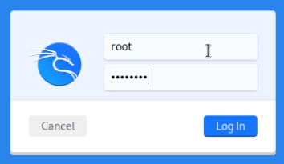

To launch Wireshark, we select the Kali **Applications** icon. It is a blue square with a white stylized dragon, located to the far left on the Kali top taskbar. 

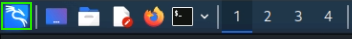

Select the search field at the top of the expanded Applications menu. 

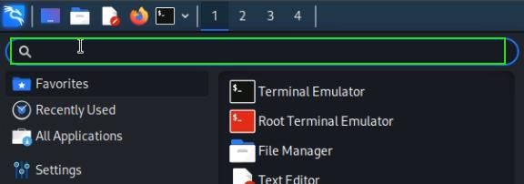

In the search field, enter **Wireshark**. 
```text
Wireshark
```
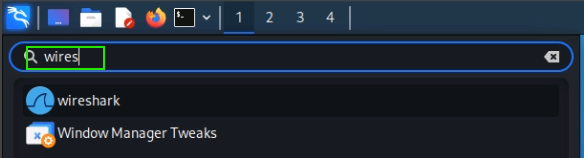

The Wireshark application should be displayed as the only result. Select **Wireshark** from the application list. 

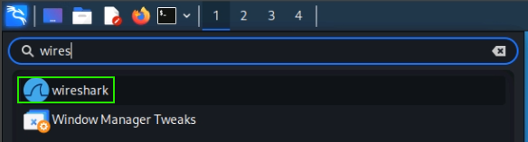

We will maximize the Wireshark window and initiate network frame collection on the eth0 interface.

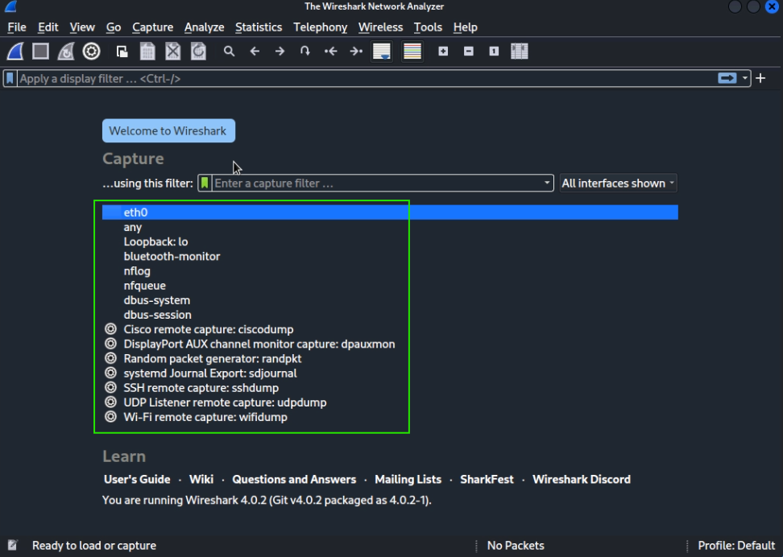

We should notice all the available interfaces listed in Wireshark that could be the focus of a network traffic capture. Wait a few seconds and see activity on the EKG-like line presented for each listed interface. If you don't already know which interface to select, you can use activity levels to help make that decision. 

Locate and double-click the **eth0** interface. 

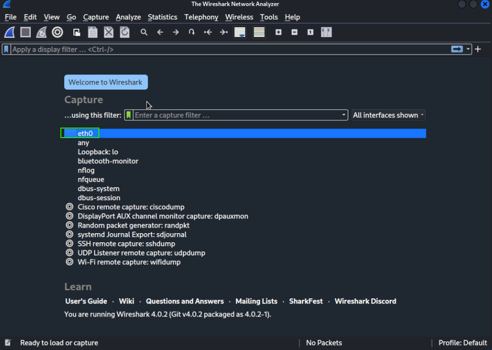

This will initiate the collection of network frames on that interface and open the primary Wireshark three-pane display.

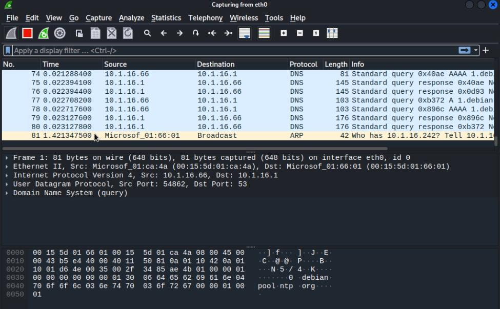

While most of the discussion around network sniffing mentions packets, it is more accurate to discuss frames. However, we will see the term packet used often, even in the Wireshark interface. Network sniffing utilities, such as Wireshark, capture Ethernet frames. Once captured, the contents of the Ethernet frame header and payload can be examined. The payload of Ethernet is often IPv4 or IPv6. The network containers of IP are called packets (operating at OSI Layer 3, the Network layer), while the network containers of Ethernet are called frames (operating at OSI Layer 2, the Data Link layer). At OSI Layer 4, the Transport layer, two protocols are common: TCP and UDP. TCP's network containers are called segments, while UDP's network containers are called datagrams. 

We will continue to capture traffic while visiting the website **www.targetwebsite.com** using Firefox. 
 
On the Kali top taskbar, select **Firefox**. The icon looks like an orange fox curled over a globe. 

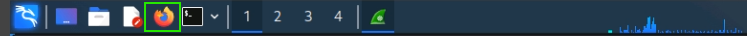

Enter **www.targetwebsite.com** in the Firefox address bar. 
```text
www.targetwebsite.com
```
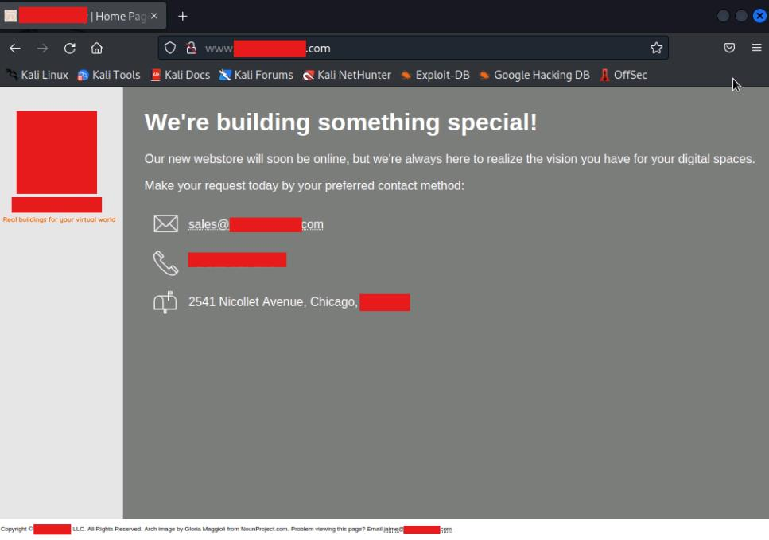

After visiting the targetwebsite, we should stop the network capture. 

We will switch back to Wireshark by selecting it from the Kali top taskbar. It should be presented as a tab with the green Wireshark shark fin logo (indicating an active capture is underway) and labelled Capture from eth0. 

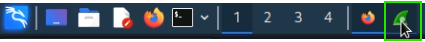

We will select the **Stop capturing packets** icon on the Wireshark toolbar. This icon looks like a red square. 

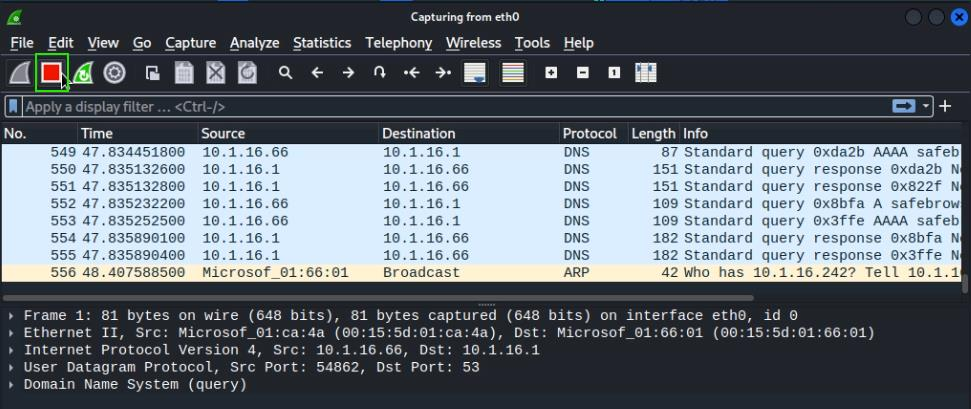

To examine the packets, we will select the first packet from the capture in the top Packet List pane.

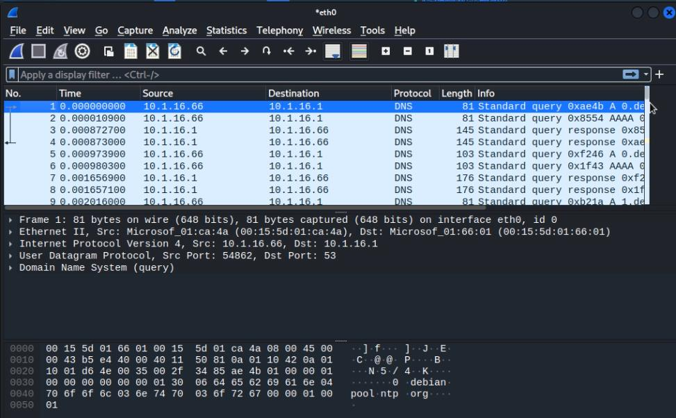

By selecting a captured frame from the top window of Wireshark (i.e., the Packet List pane in the default layout), the middle (i.e., the Packet Details pane in the default layout) and bottom (i.e., the Packet Bytes pane in the default layout) windows are focused on that single frame. We notice the middle window allows us to expand and explore the headers of all the protocols involved in this frame. For example, this could include Ethernet, IPv4, TCP, and HTTP. We also notice the bottom window is a hexadecimal presentation of the raw data of the frame and an American Standard Code for Information Interchange (ASCII) interpretation of that data. 

The middle pane, known as "Packet Details," in Wireshark, is used to expand and look at the header values of the captured frames. Any header element that is captured in plaintext can be reviewed here. Wireshark will add relative and relevant information to the header data. Any such added information will be contained in **square brackets**. For example, [Stream Index: 2] indicates that the selected frame is part of the second stream contained in the current capture. Such added data is not directly contained in the captured frames. Wireshark will also perform interpretations or provide details to help explain the values in header fields. These interpretations or explanations are contained in **parentheses**. For example: Flags: 0x012 (SYN, ACK), which is an explanation that the hex flag value of 0x012 represents the flags of synchronization and acknowledgment. Such interpretations help to clarify the meaning or purpose of the values contained in the captured frame. 

We will use Wireshark to examine the captured frames and use a simple display filter to display the **HTTP** traffic collected and attempt to locate the initial request from Kali to www.targetwebsite.com. The Kali virtual machine is using the IPv4 address of (**10.1.16.66**). 

**Note**: If we allow several minutes of time to expire between the initiation of the network capture, the accessing of the www.targetwebsite.com URL, and then stopping the capture, the initial GET request packet could be deep in the capture and hard to find manually.  

To apply filters in Wireshark we need to navigate to the top of Wireshark window, just below the toolbar, is the display filter field. In this field we will enter: **http**. But we need to make sure to press Enter on the keyboard or select Apply display filter button on the far-right end of the field, which looks like an arrow pointing right. 

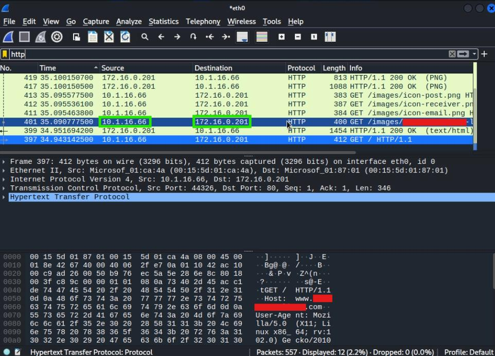


This simple display filter will hide all the captured frames except for those containing HTTP content. HTTP is an application layer (OSI layer 7) protocol used by web services. 

The captured frames being displayed will all have HTTP listed in the Protocol column. This column indicates the highest OSI level protocol discoverable in each frame. 

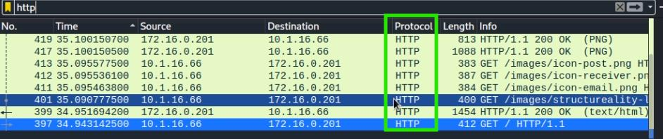

We will scroll to the top of the display filtered results to see the initial packets. The initial packets in a capture will have the lowest value in the No. column. The No. column is the relative frame number of the captured network container. The first frame captured is assigned 1, the second frame is assigned 2, etc. 

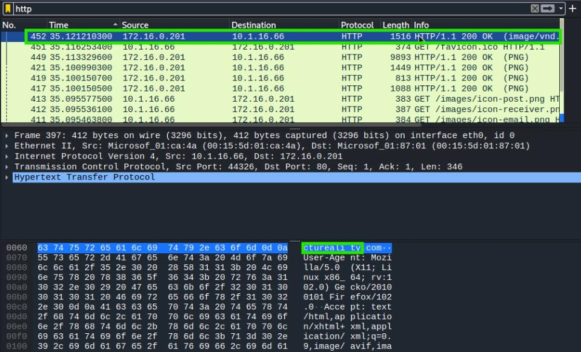

The source address of the request is 10.1.16.66. There should be a few frames with that address listed in the Source column. The top-most frame with that IP address source is most likely the request packet. 

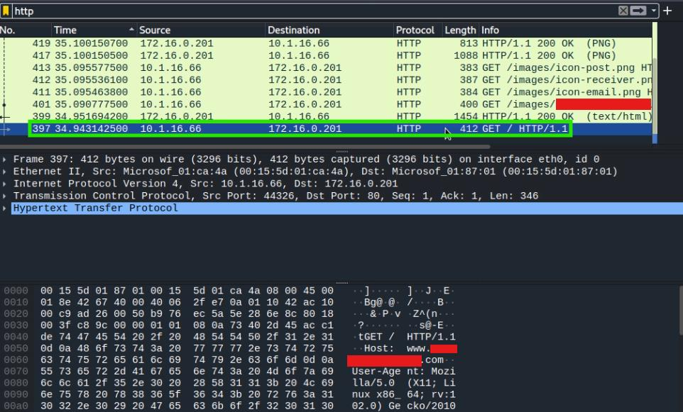

Select the displayed frame which has a Source address of 10.1.16.66, a Protocol of HTTP, and an Info statement of **GET / HTTP/1.1**. 

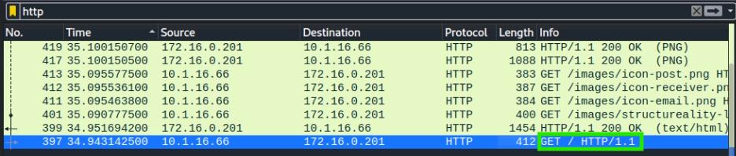

By selecting a captured frame from the top window of Wireshark, the middle and bottom windows are focused on that single frame. 

Notice the middle window allows you to expand and explore the headers of all the protocols involved in this frame. In this example, this includes Ethernet II, Internet Protocol Version 4 (i.e., IPv4), Transmission Control Protocol (i.e., TCP), and Hypertext Transfer Protocol (i.e., HTTP). 

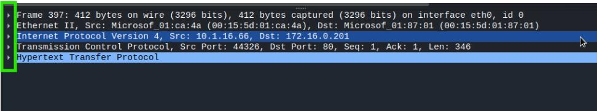

Notice the bottom window is a hexadecimal presentation of the raw data of the frame and an ASCII interpretation of that data. 

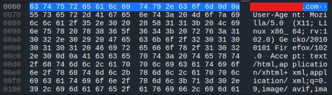

If we look in the ASCII interpretation to see if we can recognize the URL requested. We should be able to find **www.targetwebsite.com** in the 6th-7th line (those hex offsets labelled as 0040 - 0070), but it might be broken across two lines.

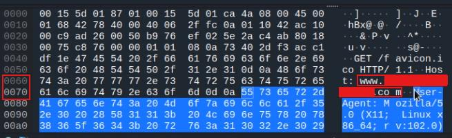

What is the IP address of the www.targetwebsite.com site? 

<details><summary>Answer</summary>
172.16.0.201</details>

The next step is to use Wireshark to determine if any DNS communications were captured. 

First, we need to delete the current display filter by selecting the **Clear display filter** button located at the far right of the display filter field. The button will be a dark grey X over a light grey square until the mouse cursor hovers over it, then it will turn red. 

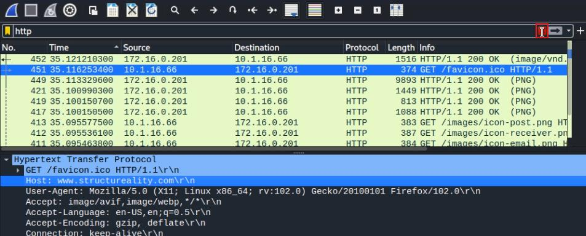

Select the display filter field, then enter: dns. Be sure to press Enter or select the **Apply display filter** arrow. 
```text
dns
```
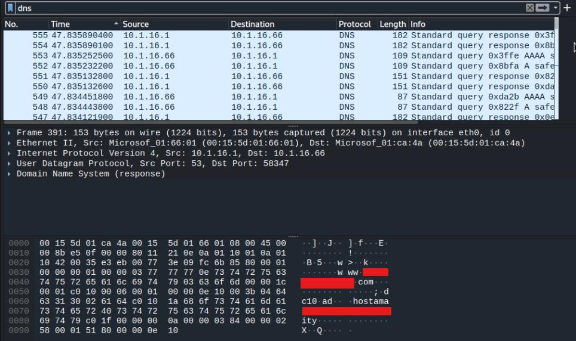

Now, the display shows communications containing the DNS protocol. 

We will clear the display filter. 

We will also leave the Wireshark and Firefox windows open. 

This exercise shows the basics of frame/packet capture, use of simple display filters, and examining the contents of captured data. This process can be enhanced using several of the features of Wireshark, including display filters, capture filters, following a TCP stream, and detailed packet analysis. 

---

## Using Display Filters 

In this exercise, we will use Wireshark's display filters to locate specific packets within a capture. 

Connect to the KALI virtual machine and sign in as **root**. 

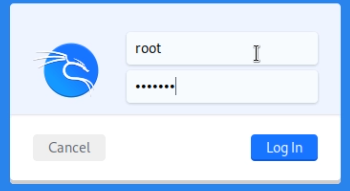

We will be using Wireshark, start a new capture, then visit **dvwa.targetwebsite.com**, then stop the capture and look at the summary of captured traffic. 

Let’s start a new Wireshark capture by selecting the** Start capturing packets** button on the Wireshark toolbar. The button looks like a shark fin and is the leftmost button on the toolbar. 

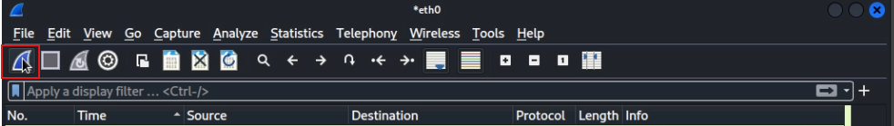

On the Unsaved packets… pop-up window, select **Continue without Saving**. 

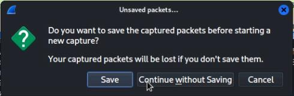

let’s switch to Firefox and visit **dvwa.structureality.com**.

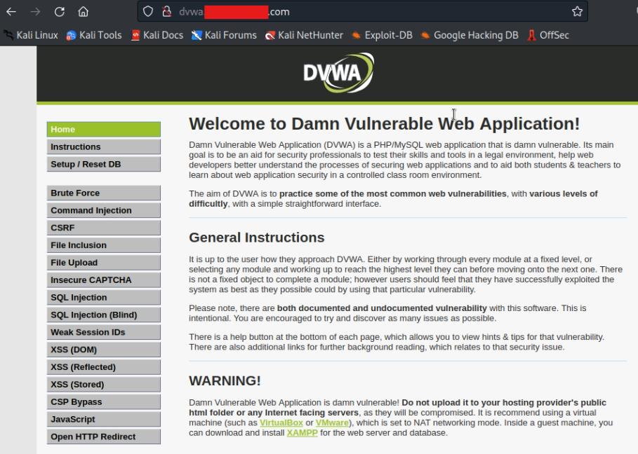

we will stop capturing by selecting the **Stop capturing packets** icon on the Wireshark toolbar. This icon looks like a red square.

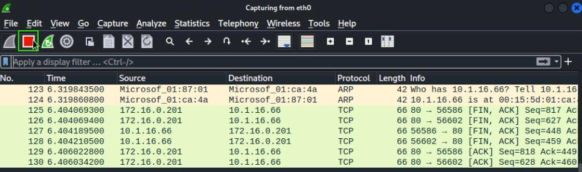

Next, we will be Using a Wireshark display filter to display only captured frames that include the IPv4 address of 10.1.16.66 as a destination.

We should select the **Apply a display filter** field and type **IP**.
```text
ip.
```

The final period is necessary. 

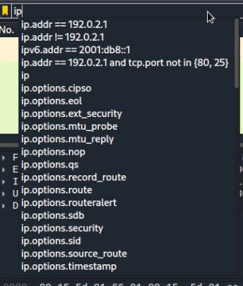

We notice that a presentation of the sub-elements of the IP. filter is displayed in a drop-down window. 

In the drop-down window, we will select **ip.dst**. 

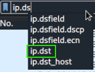

we will be continuing to type into the display filter field: ==10.1.16.66.
```text
ip.dst==10.1.16.66
```
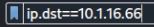

The display filter should now be ip.dst==10.1.16.66. 

We can either Press **Enter** on the keyboard or select the **Apply display filter** button on the far-right end of the field, which looks like an arrow. 

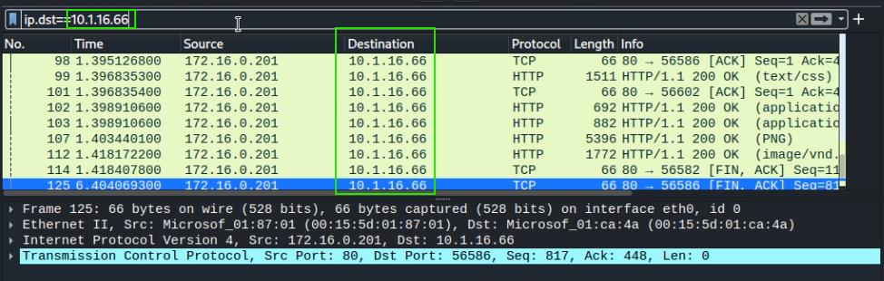

It is important to understand the comparison operators used in both display and capture filters. For an exact match, use a double equal sign (i.e., ==). For a not-equal comparison, use a bang (i.e., exclamation point) followed by an equals sign (i.e., !=). Other operators include: greater than (>), less than (<), greater than or equal to (>=), less than or equal to (<=), and contains (typically used to match a protocol, field, slice, or string). 

We should now see a display of the captured frames that include the IPv4 address of 10.1.16.66 as the destination in the header. 

We will create a new display filter that shows captured frames that have a TTL value below 128. 

But first we need to remove the current display filter by selecting the **Clear display filter** button on the far right of the display filter field.  

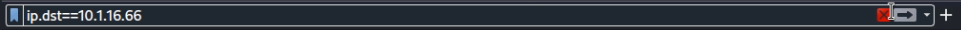

We will enter ip in the apply display filer field. 
```text
ip.
```

The final period is necessary. 

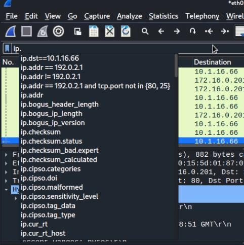

Notice that a presentation of the sub-elements of the IP filter is displayed in a drop-down window. 

We will enter ttl<128
```text
ip.ttl<128
```
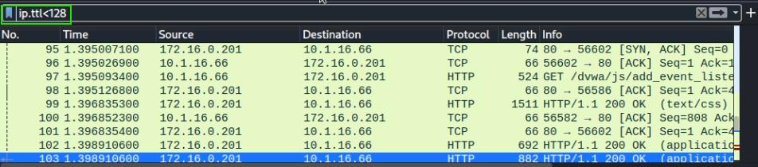

The display filter should now be ip.ttl<128. 

We will press **Enter** on the keyboard for the information to display with the new filters. 

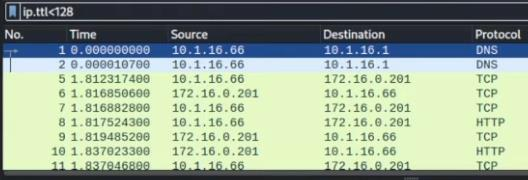

Now, the displayed captured frames are only those with a TTL value below 128. 

We will alter the display filter to include ARP frames. 

By going back to the apply a display filter field and entering or arp.

The display filter should be now ip.ttl<128 or arp.

We will press enter on the keyboard for the results to show.

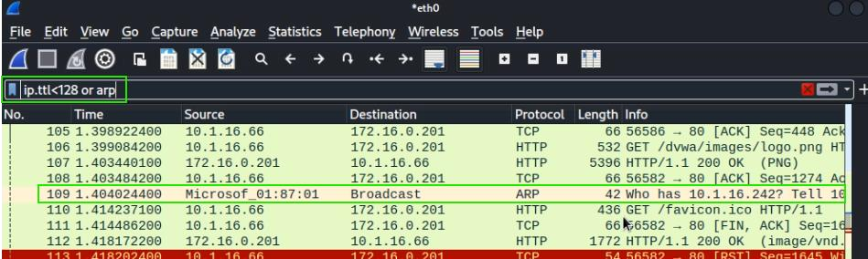

Now, the displayed captured frames are those with an IP TTL value less than 128 or which are ARP communications. 

If this display filter was defined as **ip.ttl<128 and arp**, then no packets would be displayed. Because ARP communications do not contain IP payloads, so, it is not possible for any frame to contain both an IP header (with a TTL value) and ARP at the same time. Therefore, the OR relation must be used in these types of conditions. 

We will create a new display filter to show frames that do not contain the IPv4 address of 10.1.16.66. 

Let's start by selecting the **Clear display filter** button. 

We will Enter **ip.addr!=10.1.16.66** in the display filters field.
```text
ip.addr!=10.1.16.66
```
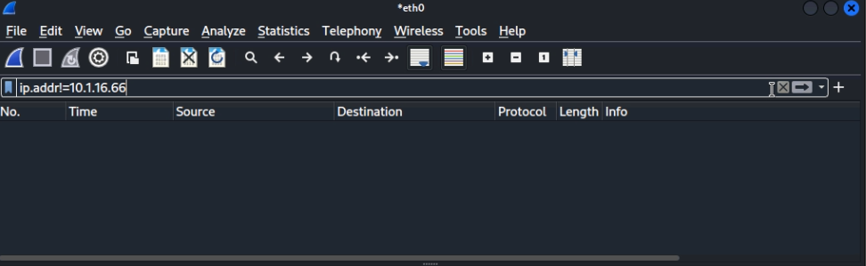

The results of this display filter are the captured frames that do not contain a source or destination address of 10.1.16.66. 

The results could be empty. Meaning there were no captured packets without the IPv4 address of 10.1.16.66. 

Use the Display Filter Expression syntax window to create a display filter to display only TCP packets with the FIN flag set. 

Let's **Clear display filter**. 

To access the Display Filter Expression syntax window, we will be selecting Analyze from the Wireshark menu, then select **Display Filter Expression**. 

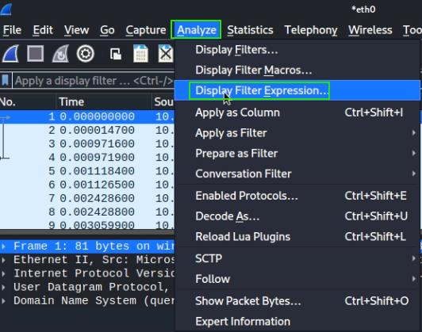

It can take up to 10 seconds for the Wireshark - Display Filter Expression window to appear. 

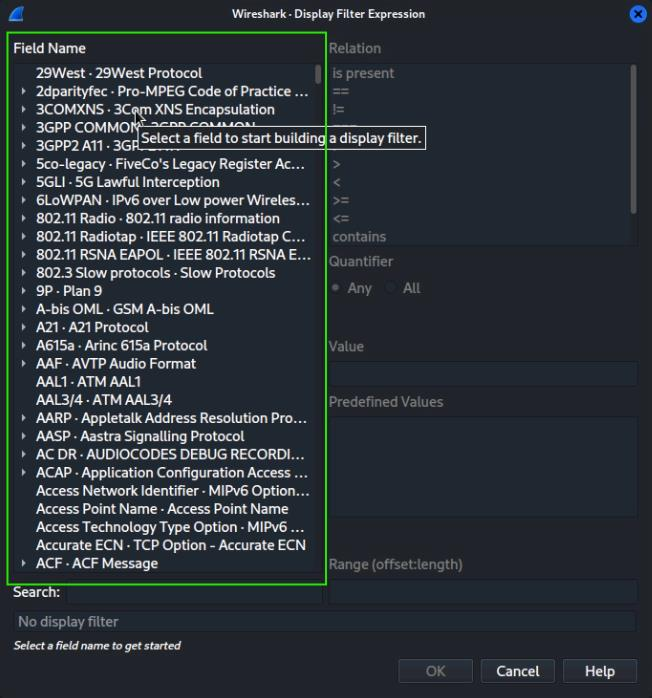

the massive list of protocols with expandable content listed in the Field Name area should display. 

In the Search: field we will enter: **tcp**.
```text
tcp
```
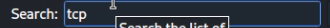

This search term will reduce the number of protocols in the Field Name area significantly, but we will still need to scroll to locate and then select **TCP - Transmission Control Protocol**. 

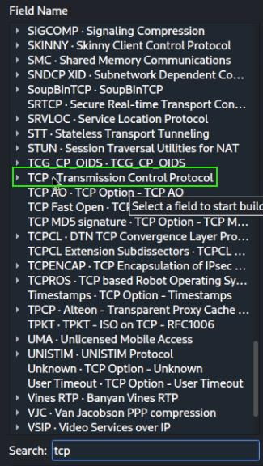

To expand its contents, we will Select the arrow to the left of the TCP entry.

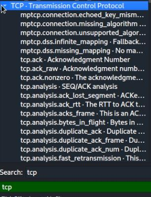

We still need to scroll down to locate and select **tcp.flags.fin ' FIN**. 

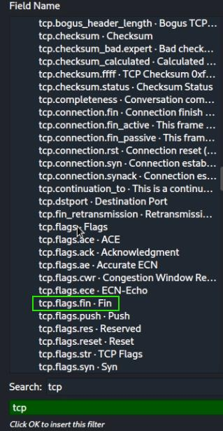

We need to verify that the Relation field has highlighted the double-equals relation (i.e., ==), the Value (Boolean) is set to 1, and the Predefined Values is set to Set.

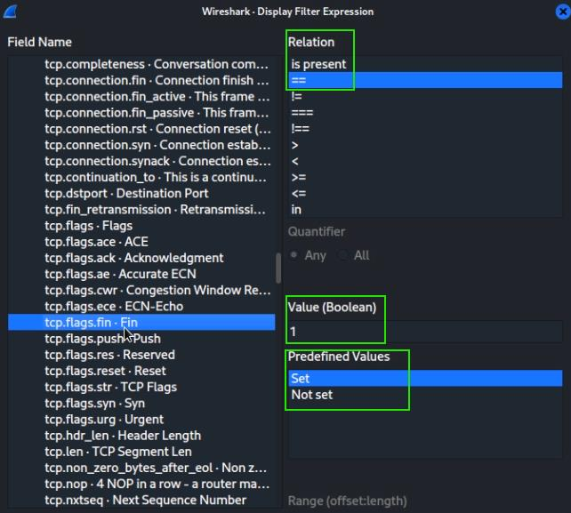

At the bottom of the Display Filter Expression window is the constructed filter field. It should be displaying **tcp.flags.fin == 1**. 

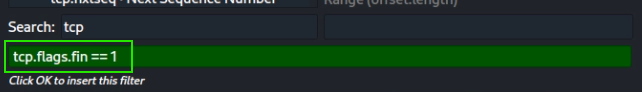

We will select **OK** to insert the constructed filter into the display filter field. 

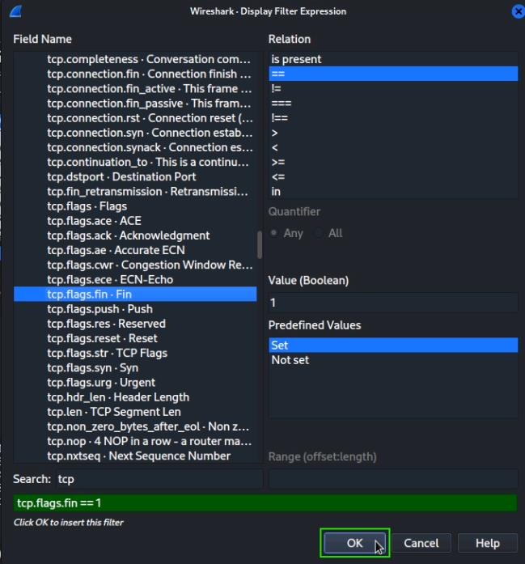

The new filter should display.

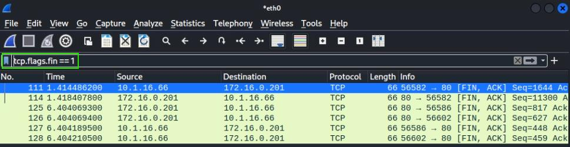

The displayed frames should all have an Info statement that includes **FIN**, which indicates that the FIN flag is set or enabled in those captured frames.

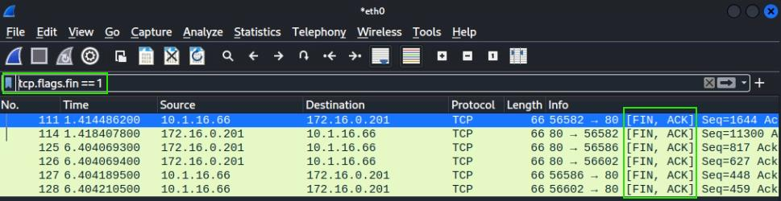

Many of the displayed frames with a FIN flag set will also have other flags set as well, such as ACK. The display filter used displays frames with any presence of the condition, not the exclusive presence of the condition. 

What is the IPv4 source address of the system that first used a FIN flag from the captured traffic? 
<details><summary>Answer</summary>
10.1.16.66
</details>

There are a staggering number of possible filter field values to choose from. The more specific protocol field value matches are, the more precise filtering results will be in gaining easy access to the portions of a communication relevant to our search parameters. 

Next, we will be modifying the current display filter to remove frames that have the ACK flag set. 

Select the display filter field and click the blank area to the right of the current filter to place the cursor at the end of the current filter. 

We will be adding **and** to the current filters by clicking the blank area to the right of the current filter. Note: there is a space before and after the word **and**.

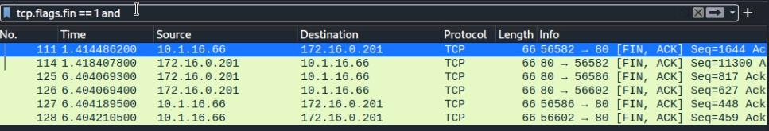

we will open the Display Filter Expression.

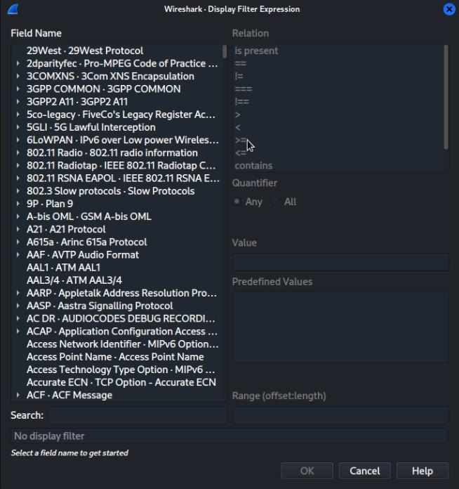

Because we already know the structure of a protocol element, we can quickly locate it by entering it into the Search: field. Enter **tcp.flags.ack** in the Search: field.
```text
tcp.flags.ack
```
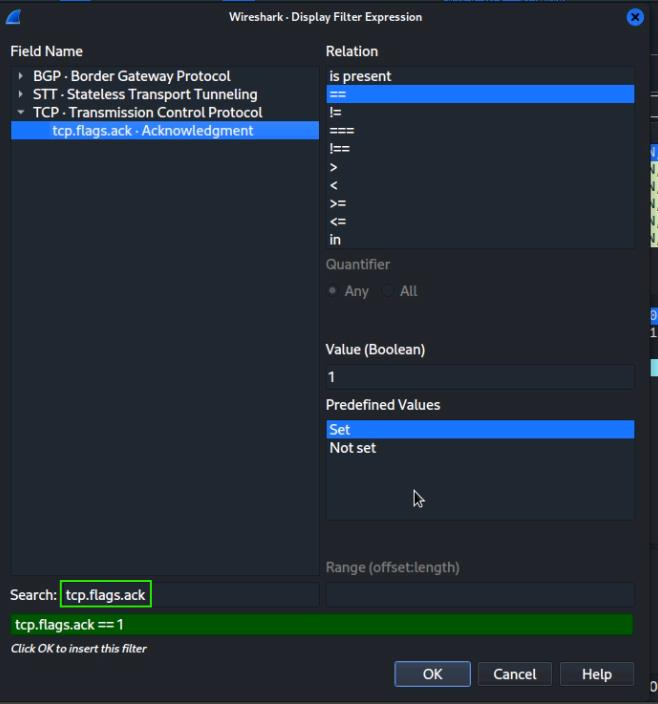

Notice the Field Name is reduced to a small number of results. Double-click **TCP** to expand its contents. 

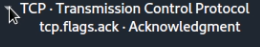

We will select **tcp.flags.ack - Acknowledgment** from the expanded contents of TCP (it should be the only item).

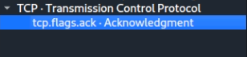

The constructed filter should be **tcp.flags.ack == 1**. 

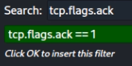

We will select **Not Set** in the Predefined Values area so the constructed filter reads **tcp.flags.ack == 0**.

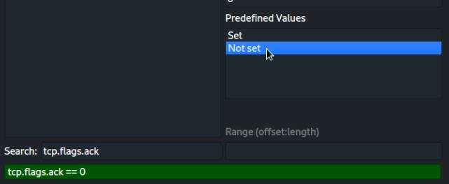

Select OK. 

The resultant display filter should be **tcp.flags.fin == 1 and tcp.flags.ack == 0**. 

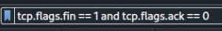

Select **Apply display filter**. 

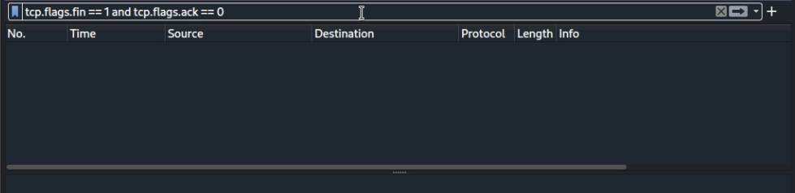

The results may be empty. 

This will likely result in no packets being displayed, as it is not common to have a FIN flag without an ACK flag. 

The Display Filter Expression tool is used to craft elements of complex filters, which are then added to any existing filter already defined in the display filter field. 

We will be Editing the display filter to display frames with FIN set but SYN not set. 

We will edit the search filter from (tcp.flags.fin == 1 and tcp.flags.ack == 0) to (tcp.flags.fin == 1 and tcp.flags.syn == 0) 

The resultant display filter should be **tcp.flags.fin == 1 and tcp.flags.syn == 0**. 

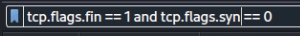

Select **Apply display filter**. 

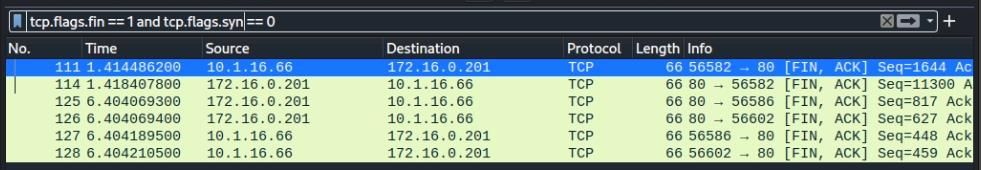

The displayed frames will be those with the FIN flag set but without the SYN flag set. 

These tasks of creating and modifying display filters demonstrate that we can type in display filters manually, craft them using the Display Filter Expression tool, combine multiple conditions with logical expressions (i.e., AND and OR), and edit existing filters directly in the display filter field. 

Select the **Clear display filter** button. 

If the capture is still running, select the **Stop capturing packets** button. 

We will leave the Wireshark and Firefox windows open. 

---

## Follow a TCP Stream

In this exercise, we will use Wireshark's follow stream function to look at the packets composing a TCP and HTTP conversation. 

We will connect to the virtual machine KALI and, sign in as **root**. 

We will continue using the traffic captured with Wireshark from the previous exercise. 

We will use a display filter to locate the first frame of the communication with dvwa.structureality.com, then access the follow TCP Stream analysis. 

We will start by removing any existing display filter from the Wireshark filter field. 

In the display filter field, we will enter **tcp contains "dvwa.targetwebsite.com"**, then select **Apply display filter**. 
```text
tcp contains "dvwa.targetwebsite.com
```
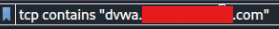

Select the first displayed frame result. 

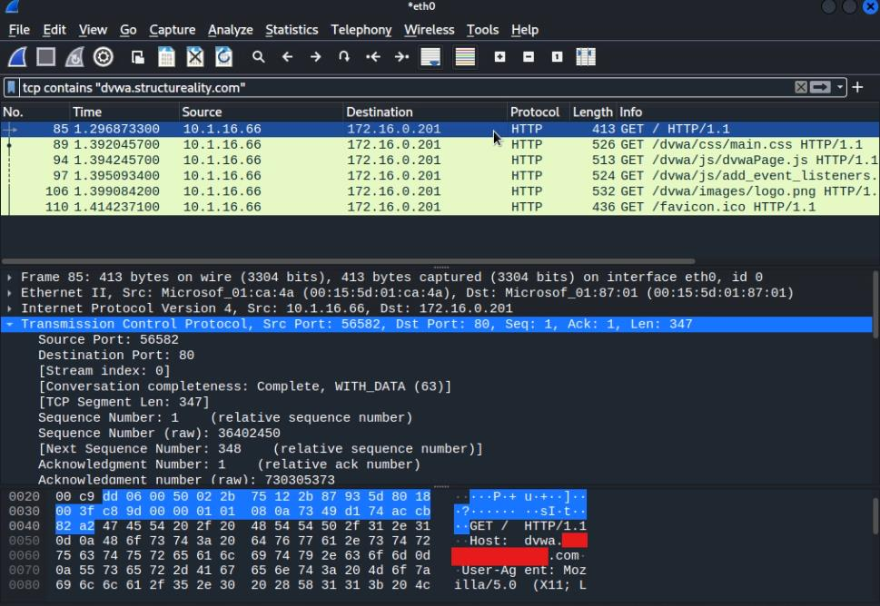

Select **Analyze** from the menu, then select **Follow**, then select **TCP Stream**. 

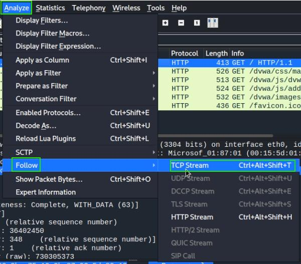

The Follow TCP Stream window opens.

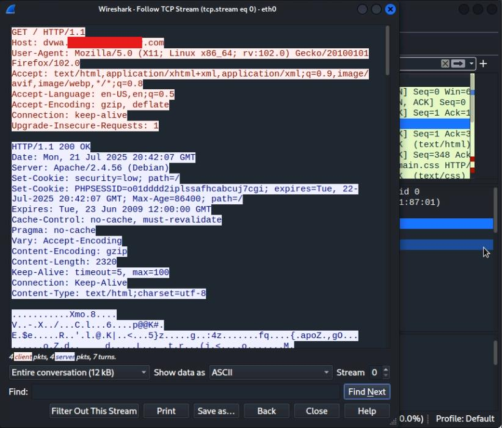

We notice the presentation is of the TCP segment and its payload. However, the payload is usually compressed, so it is unreadable in this initial format/presentation. 
 
The presentation of the TCP segments is colour coordinated with red for the client and blue for the server and presented in communication/chronological order. 

Let's close the Follow TCP Stream window. 

Next, we will open a Follow HTTP Stream from a frame containing the TCP request for dvwa.targetwebsite.com. 

We will remove any existing display filters from the Wireshark filer field. 

In the display filter field, we will enter **http**, then select **Apply display filter**. 
```text
http
```
Select the first displayed frame result. 

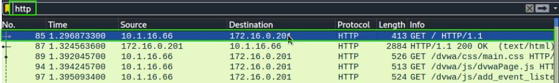

Select **Analyze** from the menu, then select **Follow**, then select **HTTP Stream**. 

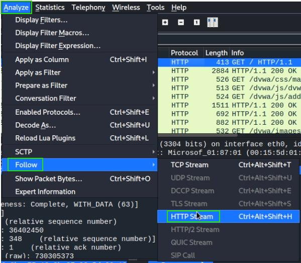

The Follow HTTP Stream window opens.

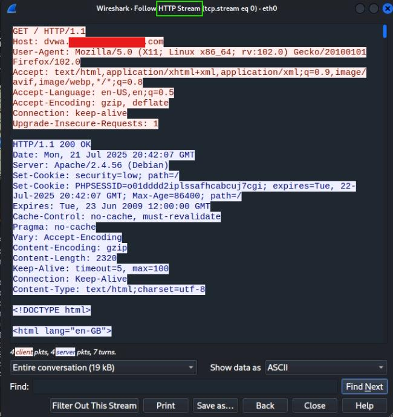

This display is similar to that of the Follow TCP Stream window. However, the compressed and/or encoded HTTP payload is now visible in ASCII/plaintext. 

We will attempt to locate in the HTTP Stream the segment from the web server which contains the HTML line of:  **<code>&lt;h1&gt;Welcome to Damn Vulnerable Web Application!&lt;/h1&gt;</code>**

In the Find: field at the bottom of the Follow HTTP Stream window, we will enter **<code>&lt;h1&gt;Welcome&lt;/h1&gt;</code>**, then select **Find Next**. 
```text
<h1>Welcome
```
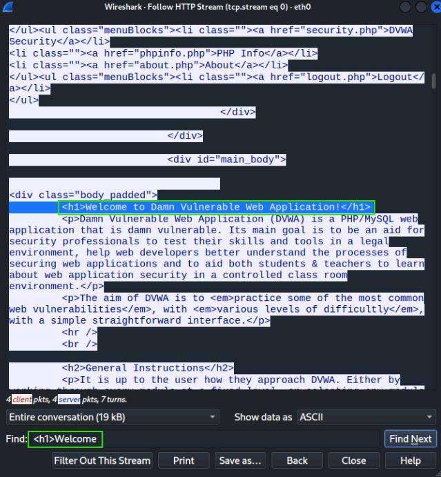

If the result does not match the HTML code of:  **<code>&lt;h1&gt;Welcome to Damn Vulnerable Web Application!&lt;/h1&gt;</code>**, then select Find Next again. 

<details>
  <summary><strong>What colour and from which side of the conversation is the HTML line <code>&lt;h1&gt;Welcome to Damn Vulnerable Web Application!&lt;/h1&gt;</code>?</strong> (Select all that apply)</summary>

#

<details><summary>client</summary>❌ Incorrect</details>
<details><summary>server</summary>✅ Correct</details>
<details><summary>red</summary>❌ Incorrect</details>
<details><summary>blue</summary>✅ Correct</details>
</details>

Close the Follow HTTP Stream window. 

Close all windows. 

The ability to use Follow HTTP Stream is limited using encrypted HTTPS communications. If the captured frames of an HTTP session are encrypted by TLS, then the option to access the Follow HTTP Stream window is not available. You can still follow the TCP stream, as the TCP headers are still in plaintext when the payload of TCP is HTTPS (i.e., TLS-encrypted web traffic). However, if the TCP headers are encrypted, as would occur over most VPNs and wireless encryption, then following TCP Stream would not be an available option. 

---

## Quiz 

<details>
  <summary><strong>1) What is the proper term for the network communication container at the Data Link Layer (Layer 2)?</strong></summary>

<details><summary>Datagram</summary>❌ Incorrect</details>
<details><summary>Segment</summary>❌ Incorrect</details>
<details><summary>Packet</summary>❌ Incorrect</details>
<details><summary>Protocol data unit</summary>❌ Too generic</details>
<details><summary>Frame</summary>✅ Correct</details>
</details>

<details>
  <summary><strong>2) Which pane of the Wireshark interface can be used to view the contents of a packet's payload in both HEX and ASCII?</strong></summary>

<details><summary>Packet List</summary>❌ Incorrect</details>
<details><summary>Packet Data</summary>✅ Correct</details>
<details><summary>Packet Stream</summary>❌ Incorrect</details>
<details><summary>Packet Details</summary>❌ Incorrect</details>
</details>

<details>
  <summary><strong>3) What display filter comparison operator is used to express that two values are not the same?</strong></summary>

<details><summary>!=</summary>✅ Correct</details>
<details><summary>/=</summary>❌ Incorrect</details>
<details><summary>==</summary>❌ Incorrect</details>
<details><summary>&lt;&gt;</summary>❌ Incorrect</details>
<details><summary>x=</summary>❌ Incorrect</details>
</details>

<details>
  <summary><strong>4) Which of the following statements is true?</strong></summary>

<details><summary>Display filters limit the packets accepted into the capture buffer.</summary>❌ Incorrect</details>
<details><summary>Capture filters are used to highlight specific frames already present in the capture buffer.</summary>❌ Incorrect</details>
<details><summary>Capture filters and display filters are defined in the same location within Wireshark.</summary>❌ Incorrect</details>
<details><summary>Display filters are used to find packets matching specific values from a capture buffer.</summary>✅ Correct</details>
</details>

<details>
  <summary><strong>5) What is the primary factor that determines what header or payload information can be viewed through a network sniffer?</strong></summary>

<details><summary>Use of switches or routers</summary>❌ Not primary</details>
<details><summary>IPv4 vs IPv6</summary>❌ Not primary</details>
<details><summary>Encryption</summary>✅ Correct</details>
<details><summary>Wired vs wireless</summary>❌ Not primary</details>
</details>


---

