## Network Incident Investigation and Remediation 

We are security analysts, supporting a large e-commerce client that reports suspected data leaks from a satellite office. Several customers have complained about phishing emails and vishing calls following conversations with Sales. We suspect the office has been compromised and that customer data is being exfiltrated and abused. 

Our goal is to investigate, confirm the source and scope of the leak, and contain the impact. We will analyse the website, network traffic, and server logs, correlate findings across those data sources, and identify indicators of compromise. Throughout the engagement, we will coordinate with the client, provide regular updates, and deliver clear recommendations to mitigate the issue and prevent further damage. 

<details><summary><stronge>Objectives & Approach</stronge></summary>
  
#
  
- **Investigate the incident.** We scope the event, build a timeline, and validate what actually happened.
- **Follow appropriate incident-response activities.** We operate through Detection & Analysis → Containment → Eradication/Recovery → Post-incident improvements.
  
</details>

<details>
  <summary><stronge>Using Data Sources</stronge></summary>

#

- **Support the investigation with data.** We combine packet captures, host logs, and other telemetry to corroborate findings.
- **Analyse logs against the PCAP.** We hunt for anomalies or suspicious activity that correlates with packet-level evidence.
</details>

<details><summary><stronge>Indicators & Attribution</stronge></summary>

#

- **Analyse indicators of malicious activity.** We extract and evaluate IoCs/behaviors relevant to the scenario.
- **Identify the nature and scope.** We determine the breach source, affected systems/files, and potential network impact.
</details>

<details><summary><stronge>Response & Hardening</stronge></summary>

#

- **Execute appropriate IR actions.** We contain, eradicate, and recover in line with policy and risk.
- **Remediate the incident.** We remove anomalous files, adjust permissions to block unauthorised access, and add security controls as needed.
- **Apply common security techniques.** We harden computing resources using proven configurations and safeguards.
- **Enhance enterprise capabilities.** We tune detections, logging, and control coverage to prevent recurrence.
</details>

<details><summary><stronge>Monitoring & Governance</stronge></summary>

#

- **Monitor for further activity.** We watch the network and endpoints for residual or follow-on signals.
- **Explain alerting and monitoring.** We document how the tools and concepts map to the detections we rely on.
- **Apply security principles to the environment.** We align infrastructure with least privilege, defense in depth, and secure configuration baselines.
</details>

## Table of Contents

1. [Investigation](#investigation)
2. [Log Analysis](#log-analysis)
3. [Incident Identification](#incident-identification)
4. [Mitigation](#mitigation)
5. [Monitoring](#monitoring)
6. [Conclusion & Remediation](#conclusion--remediation)

---

# Investigation

<details>
  <summary><strong>Analysing the pcap</strong></summary>

  #

On the **Security Onion 2.4.10 VM**, on the desktop, there is a file called **traffic.pcap** containing network traffic logs we will open it with Wireshark by just double clicking on the file.


Once Wireshark opens, we will examine the packet list panel looking at the source and **destination** we will be focusing more on the destination ignoring internal traffic 

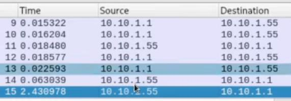

After examining all the packets, we find one external IP address which is sending data, and we can see that it’s using **PSH flag**. 


after looking at more traffic to the destination of **75.30.5.55** we come across what looks like sensitive date being sent from **internal IP** (**10.10.1.5**) to the **external IP** (**75.30.5.55**)

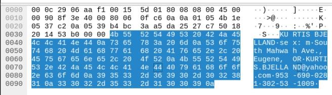

type of information: names, email address, ... 

external IP addresses: 75.30.5.55 


we should note down that IP address

</details>

<details>
  <summary><strong>Reviewing the target machine</strong></summary>

#

<details>
  <summary>Displaying the IP address</summary>

We will access the **windows server 2019 VM**. 


We will need to display and document the IPv4 address of the windows server. 

We will use Command prompt(cmd), which should be run as an administrator.


When the cmd window opens we will enter:
```cmd
ipconfig
```  


We should notice that this machine’s IP is the same internal IP that was **sending sensitive** data to 75.30.5.55 

Let's keep a note of the IP: **10.10.1.5** 
</details>

<details>
  <summary>Displaying the active connections</summary>

We now need to display the active connections and ports on which the computer is listening to and document any anomalous results  

To check active connections and ports we will use cmd again and enter: 
```cmd
netstat 
```


Again, we see the same external IP (75.30.5.55) this time also the **port (1337)** 

It seems like the attack is occurring from Port 1337 we should note that.
</details>

<details>
  <summary>Checking for unauthorised accounts</summary>

We will now check for any unauthorised accounts and document any anomalous results  

To check for unauthorised accounts, we will enter net user in cmd
```cmd
net user
```
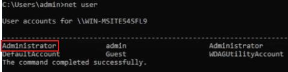

Right away we should notice a suspicious username (adm1nistrator) this means the malicious actor tried to disguise the name administrator by adding 1. 
 
we should note the anomalous user account (adm1nistrator) 

</details>

<details>
  <summary>Checking for anomalous processes</summary>

We now need to review the running applications processes and services, then document any anomalous results. 

We will enter tasklist /SVC in cmd to display current processes or applications that are running on the machine 
```cmd
tasklist /SVC
```
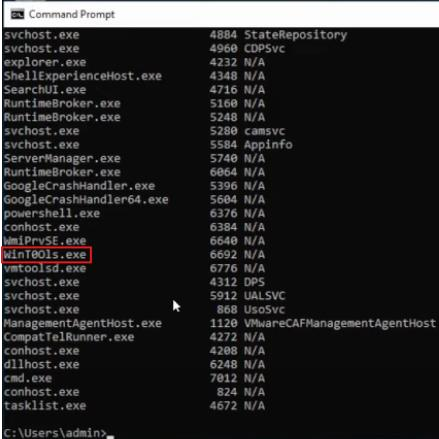

After reviewing all the processes and application one of them stood out which is **WinT0Ols.exe** this application is disguising itself as windows tool but tool is not spelled correctly. 

Just to double check let’s check this process in process explorer which is Sysinternals tool


We can see it has no description, and it’s not registered under the Microsoft corporation  

Let's note down the name of this malicious application: **WinT0ols.exe** (PID 6692)
 </details>
 
</details>

<details>
  <summary><strong>Knowledge Check</strong></summary>

#

<details>
  <summary><strong>1) On which packet number does the attack start?</strong></summary>

<details><summary>28</summary>✅ Correct</details>
<details><summary>62</summary>❌ Incorrect</details>
<details><summary>75</summary>❌ Incorrect</details>
<details><summary>103</summary>❌ Incorrect</details>
</details>

<details>
  <summary><strong>2) What protocol is being used in the attack?</strong></summary>

<details><summary>HTTP</summary>❌ Incorrect</details>
<details><summary>SSHv2</summary>❌ Incorrect</details>
<details><summary>ICMP</summary>❌ Incorrect</details>
<details><summary>TCP</summary>✅ Correct</details>
</details>

<details>
  <summary><strong>3) Which of the following is the attacker's IP address?</strong></summary>

<details><summary>64.15.112.55</summary>❌ Incorrect</details>
<details><summary>75.23.54.124</summary>❌ Incorrect</details>
<details><summary>75.30.5.55</summary>✅ Correct</details>
<details><summary>74.125.75.7</summary>❌ Incorrect</details>
</details>

<details>
  <summary><strong>4) What is the destination port for the attacker's device?</strong></summary>

<details><summary>49673</summary>❌ Incorrect</details>
<details><summary>8080</summary>❌ Incorrect</details>
<details><summary>443</summary>❌ Incorrect</details>
<details><summary>1337</summary>✅ Correct</details>
</details>
</details>

---

# Log Analysis


<details>
  <summary><strong>Analysing the Windows Event Viewer for user-creation events</strong></summary>

#

We will now examine the Windows security logs to determine if any unauthorised local accounts were created in the Windows Server 2019 machine. 

We will use **Event Viewer**. 

We can access Event viewer by Right clicking the Start button, then selecting **Event Viewer**, the Microsoft Windows Security Information and Event Management (SIEM) viewer. 

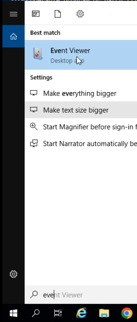


Under **Event Viewer**, we will expand **Saved Logs**, then select **security_10-18**. 

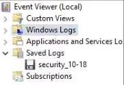

To find events of creating an account we will look at the **Actions** pane, then select the **Find...**, to show only the events related to User Account Management. 


In the box, we will enter 4720, then select Find Next. 
```text
4720
```


We should now see the event where an account was created.

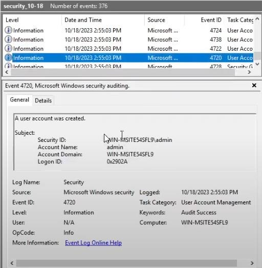

To view more details, we will click on the **Details** tab.

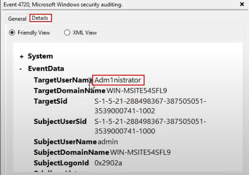

We see that an account with the username Adm1nistrator was created by the malicious actor we should document the findings.

</details>

<details>
  <summary><strong>Comparing the results to the pcap</strong></summary>

#

In a previous task, the pcap was analysed. Let's review the pcap details for specific details regarding the incident. 

We will switch back to the Security Onion 2.4.10 VM. 

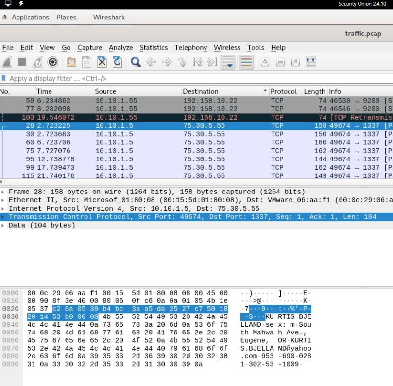

We will select one of the packets that show the source IP address of 10.10.1.5 and the destination IP address of 75.30.5.55. 


We notice some type of sensitive information being sent but it’s all mixed-up and not clear.

To see the data in clear readable format we will examine the TCP Stream to determine the type of data that was sent from 10.10.1.5 to 75.30.5.55. 

To do that we will right click on one of the packets with the source IP of 10.10.1.5 and the destination IP of 75.30.5.55, a drop down should appear with list of options we should select Follow in which we will see TCP Stream  

Or we can select the packet and click **Ctrl+Alt+Shift+T** 

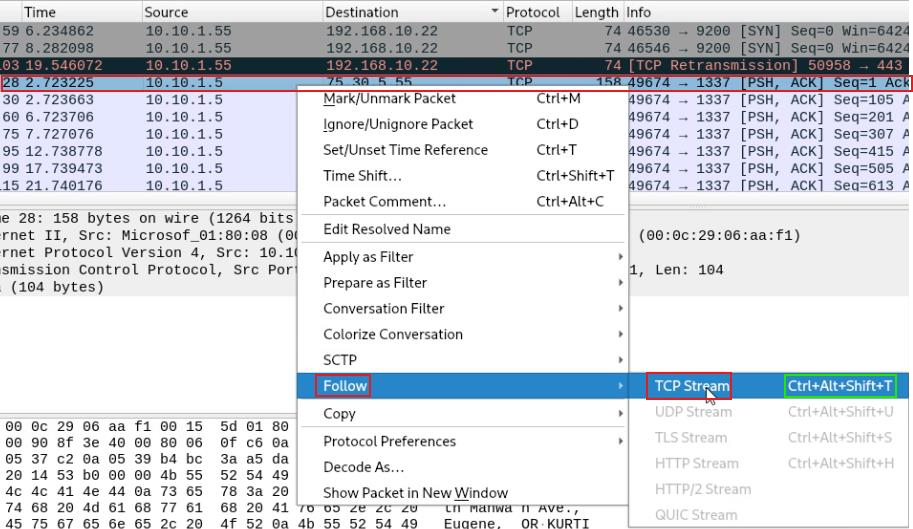

a window should display showing the data clearly 

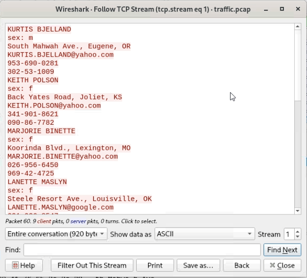

Now we can clearly identify the data in the pcap.  
- first and last names 
- gender 
- House address 
- Emails 
- Phone numbers 

This is an indication of spyware.

We should now retrieve the IP address of the Security Onion VM and compare it to the pcap packet details. 

Let's open Terminal.

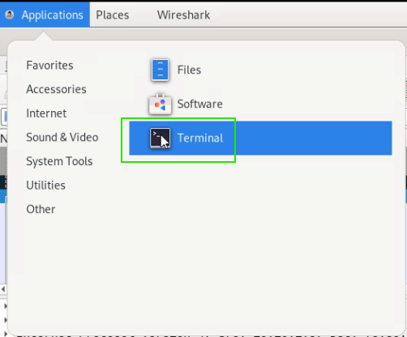

Once the terminal opens, we should enter: 
```bash
ifconfig
```


That will display a list of current configurations for a network interface.

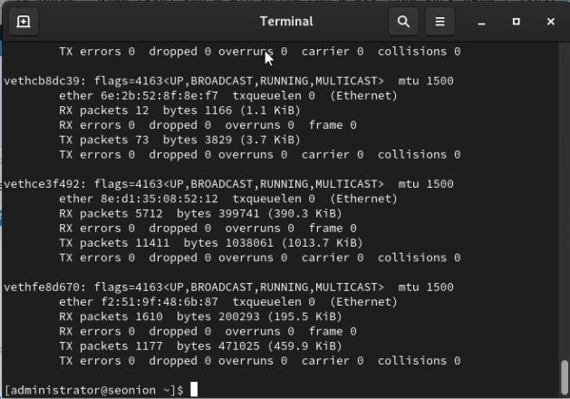

If sometimes the list is too long, we can just search it by clicking on the search tool on the top, and enter: 
```bash
ens32 
```
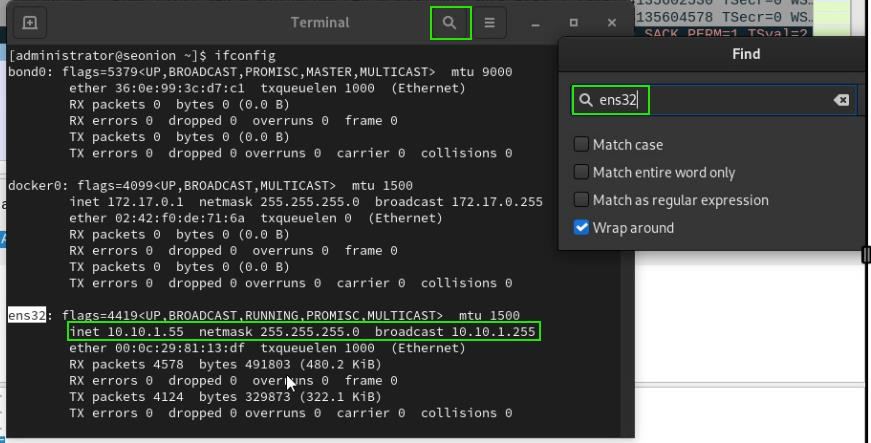

we should note the security onion VM’s primary IP address: 10.10.1.15

</details>

<details>
  <summary><strong>Knowledge Check</strong></summary>

#

<details>
  <summary><strong>1) What type of encryption is being used on the compromised data?</strong></summary>

<details><summary>SFTP</summary>❌ Incorrect</details>
<details><summary>AES</summary>❌ Incorrect</details>
<details><summary>RSA</summary>❌ Incorrect</details>
<details><summary>None</summary>✅ Correct — the data is sent in plaintext.</details>
</details>

<details>
  <summary><strong>2) Which of the following, based on the exploit, is the malware type?</strong></summary>

<details><summary>Trojan</summary>❌ Incorrect</details>
<details><summary>Rootkit</summary>❌ Incorrect</details>
<details><summary>Worm</summary>❌ Incorrect</details>
<details><summary>Spyware</summary>✅ Correct</details>
</details>

<details>
  <summary><strong>3) What is the New Account Security ID of the new account that was created?</strong></summary>

<details><summary>WIN-MSITE54SFL9\Guest</summary>❌ Incorrect</details>
<details><summary>WIN-MSITE54SFL9VAdministrator</summary>❌ Incorrect</details>
<details><summary>WIN-MSITE54SFL9\DefaultAccount</summary>❌ Incorrect</details>
<details><summary>WIN-MSITE54SFL9\Adm1nistrator</summary>✅ Correct</details>
</details>
</details>

---

## Incident Identification

<details>
  <summary><strong>Reviewing the target machine's findings</strong></summary>

#

Based on the notes we have it seems that the data that was be exfiltrated was PII (Personally Identifiable Information)  

- Social security numbers 
- customer names 
- customer house addresses 
- customer email addresses


We also know that a malware application was used to extract the data and establish the connection to 75.30.5.55, from our notes we know the malware name is WinT0Ols.exe. 

Our next step should be to document the location of the malicious process/application.  

To do that we will Switch back to the **Windows Server 2019 VM**.

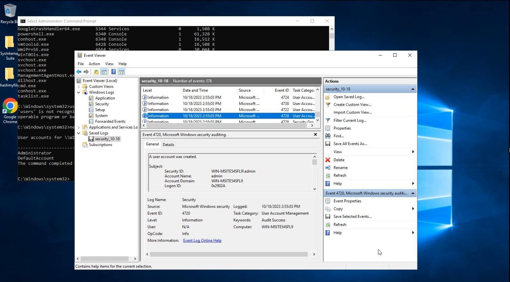

We need to access task manager and to do that we can either **press Ctrl + Shift +Esc simultaneously** or by right clicking on the taskbar and then Selecting **Task Manager**.

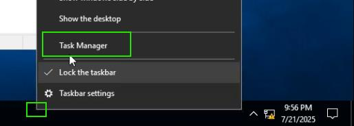

Once the **Task Manager** opens, we can press (W) on the keyboard till we get to the processes with the name **WinT0Ols** which we will then right click and select **open file location**. 

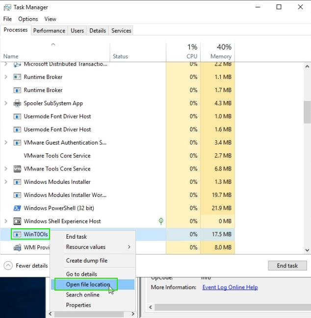

File explorer should open, and the file path should be displayed on the top 

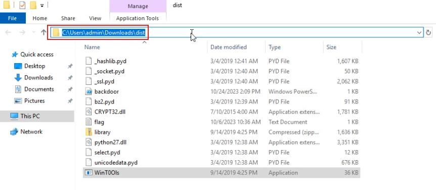

Let's keep a note of the malicious file path: **C:\Users\admin\Downloads\dist** 

</details>

<details>
  <summary><strong>Knowledge Check</strong></summary>

#

<details>
  <summary><strong>1) Which of the following were compromised? (Check all that apply)</strong></summary>

<details><summary>Customer addresses</summary>✅ Correct</details>
<details><summary>Credit card numbers</summary>❌ Incorrect</details>
<details><summary>Customer names</summary>✅ Correct</details>
<details><summary>Social security numbers</summary>✅ Correct</details>
</details>

<details>
  <summary><strong>2) Which of the following is the data classification that is being exfiltrated?</strong></summary>

<details><summary>PCI</summary>❌ Incorrect</details>
<details><summary>PII</summary>✅ Correct</details>
<details><summary>PHI</summary>❌ Incorrect</details>
<details><summary>PII, PHI, PCI</summary>❌ Incorrect</details>
</details>

<details>
  <summary><strong>3) Which of the following is the name of the malware you found on the Windows Server 2019 VM?</strong></summary>

<details><summary>Command.exe</summary>❌ Incorrect</details>
<details><summary>Explorer.exe</summary>❌ Incorrect</details>
<details><summary>Overwatch.exe</summary>❌ Incorrect</details>
<details><summary>WinTOOls.exe</summary>✅ Correct</details>
</details>
</details>

---

## Mitigation

#

<details>
  <summary><strong>Mitigating the unauthorised user account</strong></summary>

#

To prevent access and control to the windows server VM we will disable the unauthorised user account we found on Windows Server in the previous steps.  

To disable user accounts, we will access **Computer Management**.  

As we have the server manager open, we will just do it from there by clicking on Tools which is on the top right of the screen and then selecting **Computer Management**.

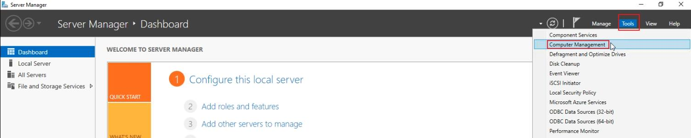

Computer management window should open.

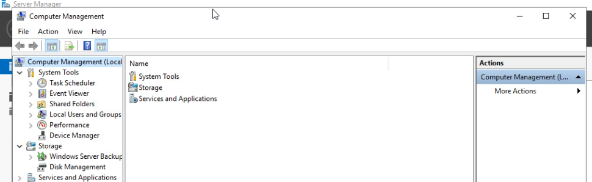

From the left panel we will click on Local **users and Groups** > **users** and that should display all the users on the device.

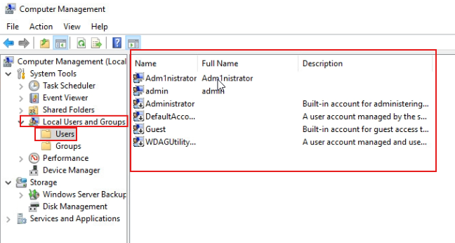

We need to disable the unauthorised user (Adm1nistrator) to do that we will right click on Adm1nistrator and select **Properties**.


A properties window should open, displaying three checkboxes, we will select** Account is disabled** to disable the account. 

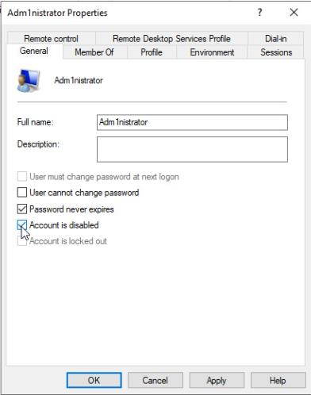

This should disable the account and prevent further damage or malicious acts.

</details>


<details>
  <summary><strong>Mitigating the malicious application</strong></summary>

#

To prevent or end the connection of the malicious application we will disable / end the application running on Windows Server.

There are few ways to do that we can either use Task Manager or Process Explorer for now we will use Task Manager. 

We already have **Task Manager** open so we will right click on the malicious application (**WinT0Ols**) and select **End Task**. 

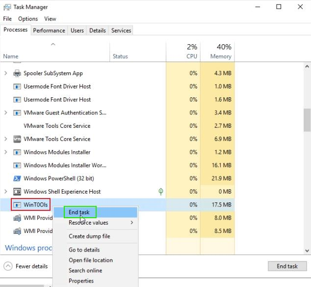

Once we click on End task the application should close and with it the established connection, to double check we can look at the list of processes again and if it’s not there it means we have killed its process. 

</details>

<details>
  <summary><strong>Knowledge Check</strong></summary>

#

<details>
  <summary>Which of the following is the Windows application that can be used to determine if the exploit resurfaces?</summary>

<details><summary>Explorer</summary>❌ Incorrect</details>
<details><summary>Task Scheduler</summary>❌ Incorrect</details>
<details><summary>Microsoft Antivirus Toolkit</summary>❌ Incorrect</details>
<details><summary>Task Manager</summary>✅ Correct</details>
</details>

</details>

---

## Monitoring

#

<details>
  <summary><strong>Verifying the malicious application was terminated.</strong></summary>

#

Sometimes we can miss the process of the malicious application if we just double check in the task manager, to verify that the malicious application was terminated and did not restart we will use **PowerShell**. 

In the taskbar there is a search tool we will search **PowerShell**; we will right click on **Windows PowerShell** and select **Run as administrator**. 


Once Windows PowerShell opens, we will run the following command to verify that the malicious application was terminated.  
```powershell
Get-Process -Name WinT0Ols
```


The resulting message indicates that the process was not found to be running. Which means we have successfully disabled/ended the malicious application. 

</details>

<details>
  <summary><strong>Verifying the malicious packets transmissions has been terminated.</strong></summary>

#

We now should verify the malicious packets transmissions has been terminated by recapturing network traffic and reviewing the pcap. 
 
We will switch to the Security Onion 2.4.10 VM. 
 
We will open a new **Wireshark**.

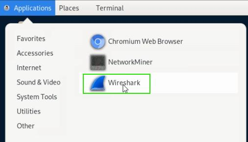

In Wireshark, on the menu, select **Capture > Start**. 


In the middle panel we should select **ens32**.


We should allow the capture to run for approximately 10 seconds, then we should **Stop.**

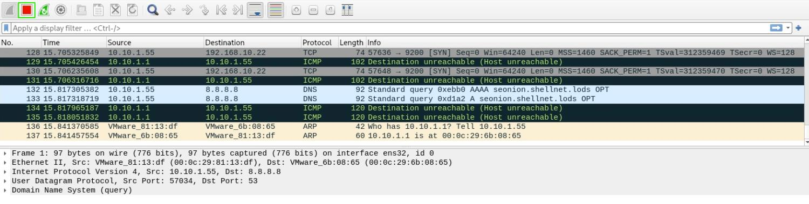

Once the capture is complete, we should review the pcap to verify that there are no packets that have **75.30.5.55** as the destination. 

In the search bar where it says “Apply a display filter ... <Ctrl-/>” we will enter:
```text
ip.addr==75.30.5.55 
```


If no packets are showing it means that the malicious packets transmissions have been terminated.

</details>

---

## Conclusion & Remediation

<details>
  <summary><strong>Executive Summary</strong></summary>

#

Outbound data exfiltration was traced to a Windows Server 2019 host at **10.10.1.5**. The host established TCP sessions to **75.30.5.55** over **port 1337**, during which **personally identifiable information (PII)**—customer names, addresses, email addresses, phone numbers, and Social Security numbers—was transmitted in clear text. Host and network evidence indicate **spyware-style exfiltration** rather than a legitimate encrypted transfer.
</details>

<details>
  <summary><strong>Key Findings</strong></summary>

#

- **Source host:** 10.10.1.5 (Windows Server 2019)
- **Destination:** 75.30.5.55:1337 (unapproved egress)
- **Sensitive data:** PII (names, addresses, emails, phone numbers, SSNs) observed in clear text
- **Malicious process:** `WinT0Ols.exe` (PID **6692**), executed from `C:\\Users\\admin\\Downloads\\dist`
- **Unauthorised account:** `Adm1nistrator` (created; Event ID **4720**)
- **Business impact:** Customer data leakage associated with subsequent phishing/vishing complaints
</details>

<details>
  <summary><strong>Actions Taken & Current Status</strong></summary>

#
  
- Disabled the rogue local account **Adm1nistrator**.
- Terminated the malicious process **WinT0Ols.exe** and removed known artifacts in the staging directory.
- Implemented temporary egress blocks to **75.30.5.55** and validated **no further traffic** to the destination.
- Current status: **Contained** (no active exfiltration observed).
  
</details>

<details>
  <summary><strong>Recommendations</strong></summary>

#

1. **Eradication & Hardening**
   - Reimage the affected server from a **known-good baseline**.
   - Rotate **all local and administrative credentials**.
   - Remove residual artifacts under `C:\\Users\\admin\\Downloads\\dist`.
   - Enforce **application allow‑listing** and reduce local admin rights.

2. **Detection & Monitoring**
   - Deploy/strengthen **EDR** coverage across endpoints.
   - Add **SIEM** detections for:
     - Event ID **4720** (suspicious account creation).
     - Unusual outbound ports (e.g., **1337**) and destinations.
     - Anomalous PSH‑heavy flows and clear‑text data egress.
   - Retain **pcaps** and log sources for forensic look‑back.

3. **Network Controls**
   - Implement **egress filtering** to restrict outbound ports/destinations by policy.
   - Block and continuously monitor indicators (e.g., **75.30.5.55**, `WinT0Ols.exe`).

4. **Data Protection & Notification**
   - Treat exposed records as **compromised PII**.
   - Coordinate with **Legal/Compliance** on stakeholder notification and regulatory obligations.
   - Improve data‑handling controls to **prevent clear‑text transmission**.

5. **Awareness & Process**
   - Brief staff on the incident and refresh **phishing/vishing awareness**.
   - Review and update **incident response runbooks** to reduce time‑to‑detect and time‑to‑contain.
</details>

### Indicators of Compromise (IoCs)
| Type | Value |
|------|------|
| Source Host | 10.10.1.5 |
| Destination IP | 75.30.5.55 |
| Destination Port | 1337 (TCP) |
| Malicious Process | `WinT0Ols.exe` (PID 6692) |
| File Path | `C:\\Users\\admin\\Downloads\\dist` |
| Unauthorised Account | `Adm1nistrator` |
| Windows Event | 4720 (Account Created) |

