## Network Incident Investigation and Remediation 

We are security analysts, supporting a large e-commerce client that reports suspected data leaks from a satellite office. Several customers have complained about phishing emails and vishing calls following conversations with Sales. We suspect the office has been compromised and that customer data is being exfiltrated and abused. 

Our goal is to investigate, confirm the source and scope of the leak, and contain the impact. We will analyze the website, network traffic, and server logs, correlate findings across those data sources, and identify indicators of compromise. Throughout the engagement, we will coordinate with the client, provide regular updates, and deliver clear recommendations to mitigate the issue and prevent further damage. 

<stronge>Objectives & Approach</stronge>

- **Investigate the incident.** We scope the event, build a timeline, and validate what actually happened.
- **Follow appropriate incident-response activities.** We operate through Detection & Analysis → Containment → Eradication/Recovery → Post-incident improvements.

  
<stronge>Using Data Sources</stronge>

- **Support the investigation with data.** We combine packet captures, host logs, and other telemetry to corroborate findings.
- **Analyze logs against the PCAP.** We hunt for anomalies or suspicious activity that correlates with packet-level evidence.

<stronge>Indicators & Attribution</stronge>

- **Analyze indicators of malicious activity.** We extract and evaluate IoCs/behaviors relevant to the scenario.
- **Identify the nature and scope.** We determine the breach source, affected systems/files, and potential network impact.

<stronge>Response & Hardening</stronge>

- **Execute appropriate IR actions.** We contain, eradicate, and recover in line with policy and risk.
- **Remediate the incident.** We remove anomalous files, adjust permissions to block unauthorized access, and add security controls as needed.
- **Apply common security techniques.** We harden computing resources using proven configurations and safeguards.
- **Enhance enterprise capabilities.** We tune detections, logging, and control coverage to prevent recurrence.

<stronge>Monitoring & Governance</stronge>

- **Monitor for further activity.** We watch the network and endpoints for residual or follow-on signals.
- **Explain alerting and monitoring.** We document how the tools and concepts map to the detections we rely on.
- **Apply security principles to the environment.** We align infrastructure with least privilege, defense in depth, and secure configuration baselines.

## Table of Contents

1. [Investigation](#investigation)
2. [Log Analysis](#log_analysis)
3. [Incident Identification](#incident-identification)
4. [Mitigation](#mitigation)
5. [Monitoring](#monitoring)
6. [Conclusion & Remediation](#conclusion--remediation)

---

## Investigation

### Analysing the pcap

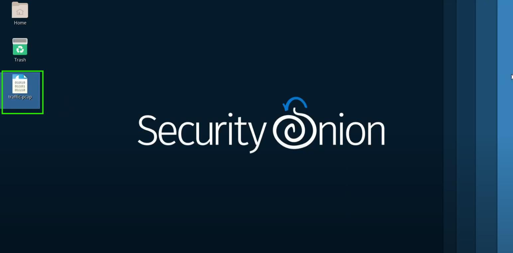

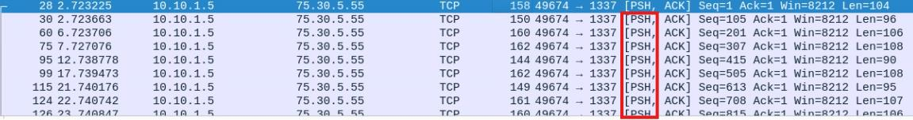

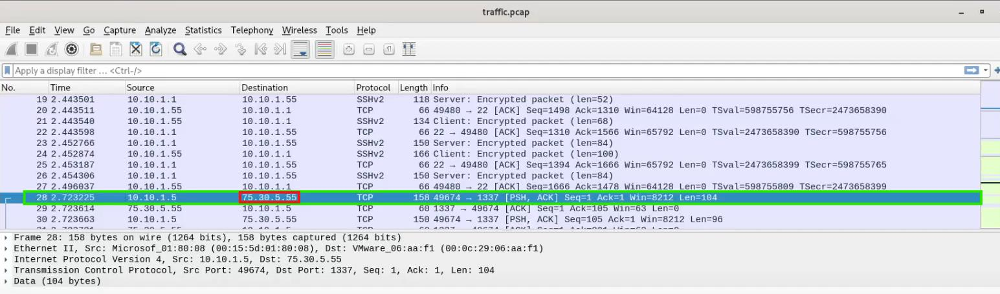

### Reviewing the target machine

### Knowledge Check

---

## Log Analysis

### Analysing the Windows Event Viewer for user-creation events

### Comparing your results to the pcap

### Knowledge Check

---

## Incident Identification

### Reviewing the target machine's findings

### Knowledge Check

---

## Mitigation

### Mitigating the unauthorized user account

### Mitigating the malicious application

### Knowledge Check

---

## Monitoring

### Verifying the malicious application was terminated.

### Verifying the malicious packets transmissions has been terminated.

---

## Conclusion & Remediation

### Executive Summary
Outbound data exfiltration was traced to a Windows Server 2019 host at **10.10.1.5**. The host established TCP sessions to **75.30.5.55** over **port 1337**, during which **personally identifiable information (PII)**—customer names, addresses, email addresses, phone numbers, and Social Security numbers—was transmitted in clear text. Host and network evidence indicate **spyware-style exfiltration** rather than a legitimate encrypted transfer.

### Key Findings
- **Source host:** 10.10.1.5 (Windows Server 2019)
- **Destination:** 75.30.5.55:1337 (unapproved egress)
- **Sensitive data:** PII (names, addresses, emails, phone numbers, SSNs) observed in clear text
- **Malicious process:** `WinT0Ols.exe` (PID **6692**), executed from `C:\\Users\\admin\\Downloads\\dist`
- **Unauthorized account:** `Adm1nistrator` (created; Event ID **4720**)
- **Business impact:** Customer data leakage associated with subsequent phishing/vishing complaints

### Actions Taken & Current Status
- Disabled the rogue local account **Adm1nistrator**.
- Terminated the malicious process **WinT0Ols.exe** and removed known artifacts in the staging directory.
- Implemented temporary egress blocks to **75.30.5.55** and validated **no further traffic** to the destination.
- Current status: **Contained** (no active exfiltration observed).

### Recommendations
1. **Eradication & Hardening**
   - Reimage the affected server from a **known-good baseline**.
   - Rotate **all local and administrative credentials**.
   - Remove residual artifacts under `C:\\Users\\admin\\Downloads\\dist`.
   - Enforce **application allow‑listing** and reduce local admin rights.

2. **Detection & Monitoring**
   - Deploy/strengthen **EDR** coverage across endpoints.
   - Add **SIEM** detections for:
     - Event ID **4720** (suspicious account creation).
     - Unusual outbound ports (e.g., **1337**) and destinations.
     - Anomalous PSH‑heavy flows and clear‑text data egress.
   - Retain **pcaps** and log sources for forensic look‑back.

3. **Network Controls**
   - Implement **egress filtering** to restrict outbound ports/destinations by policy.
   - Block and continuously monitor indicators (e.g., **75.30.5.55**, `WinT0Ols.exe`).

4. **Data Protection & Notification**
   - Treat exposed records as **compromised PII**.
   - Coordinate with **Legal/Compliance** on stakeholder notification and regulatory obligations.
   - Improve data‑handling controls to **prevent clear‑text transmission**.

5. **Awareness & Process**
   - Brief staff on the incident and refresh **phishing/vishing awareness**.
   - Review and update **incident response runbooks** to reduce time‑to‑detect and time‑to‑contain.

### Indicators of Compromise (IoCs)
| Type | Value |
|------|------|
| Source Host | 10.10.1.5 |
| Destination IP | 75.30.5.55 |
| Destination Port | 1337 (TCP) |
| Malicious Process | `WinT0Ols.exe` (PID 6692) |
| File Path | `C:\\Users\\admin\\Downloads\\dist` |
| Unauthorized Account | `Adm1nistrator` |
| Windows Event | 4720 (Account Created) |

---

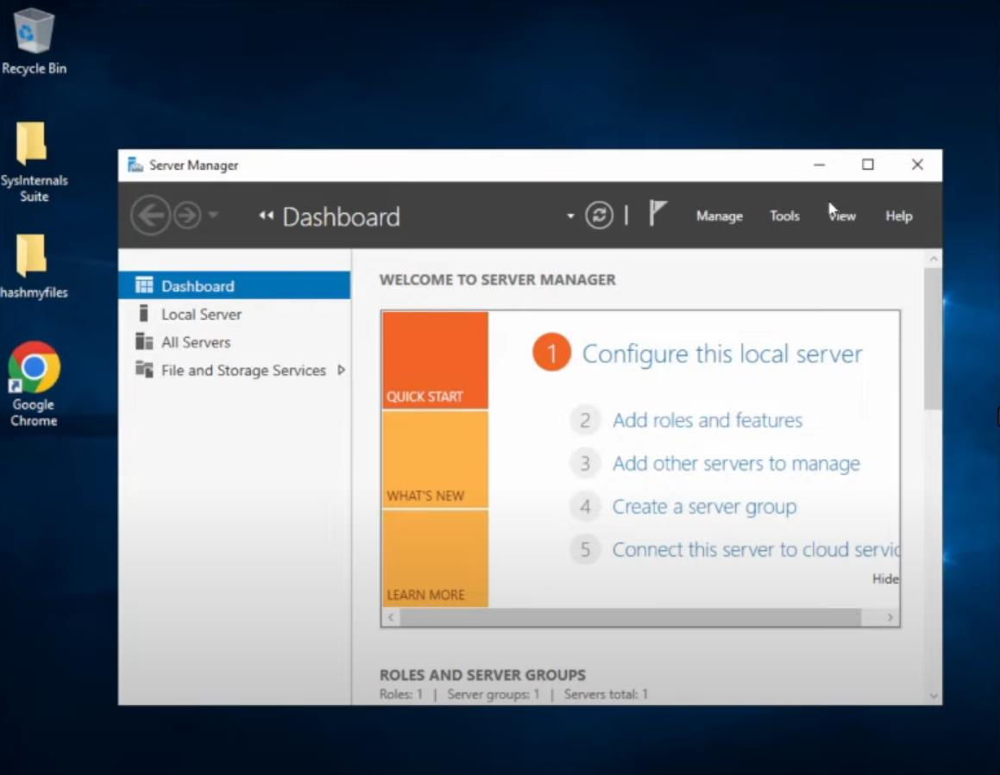
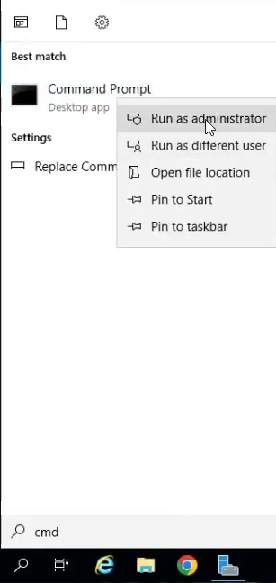
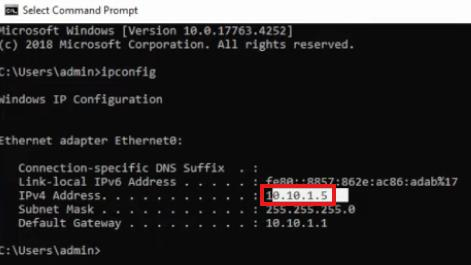
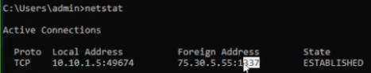

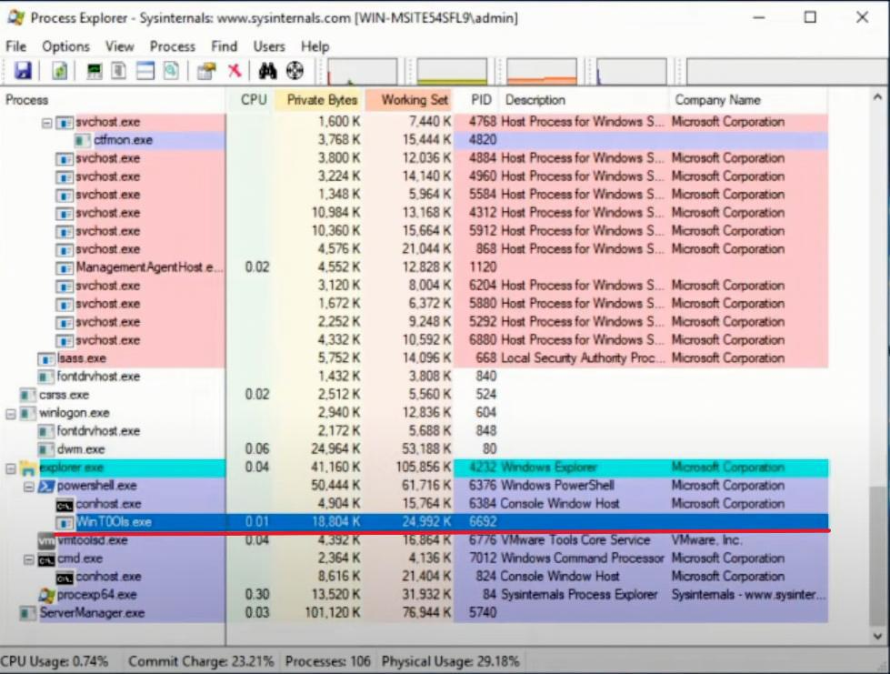

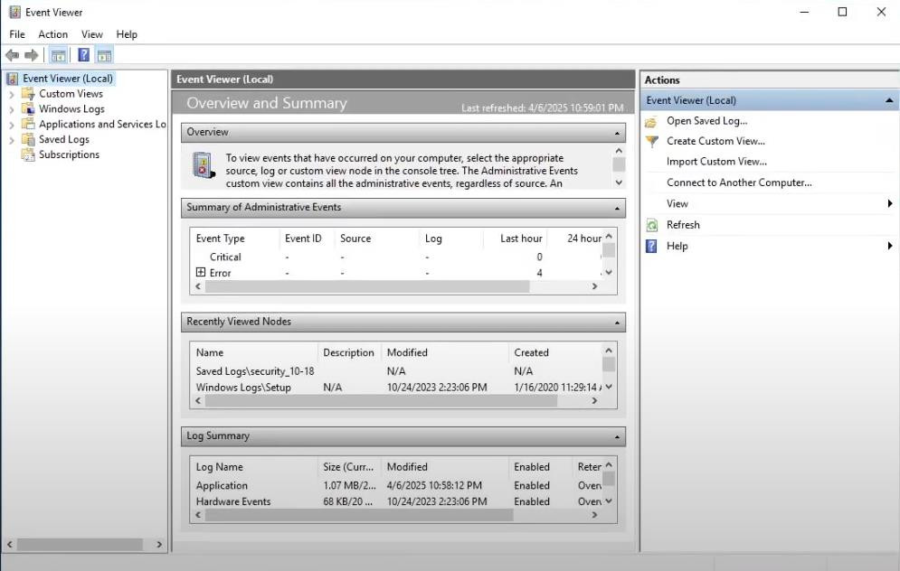

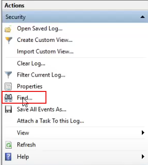
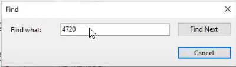

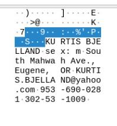

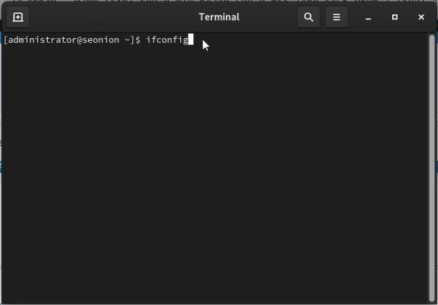

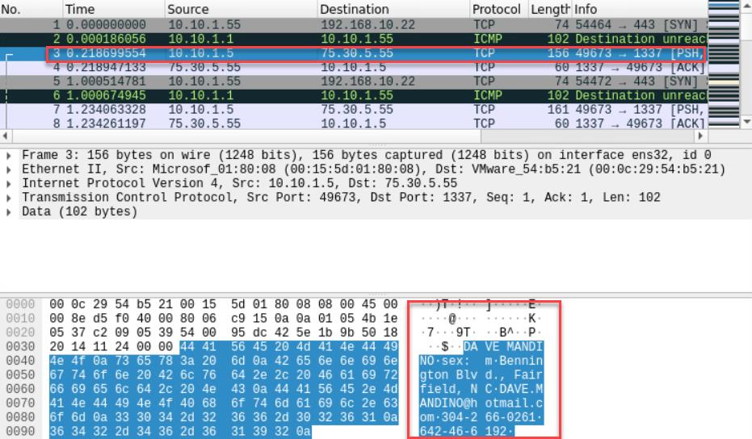

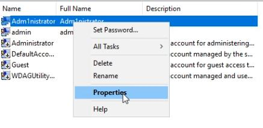

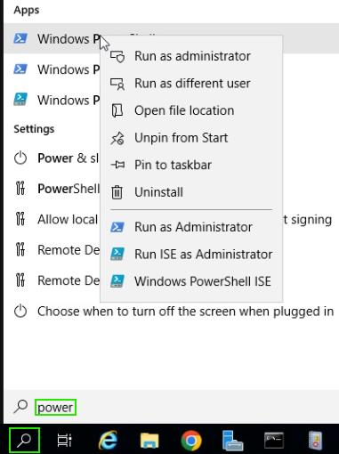
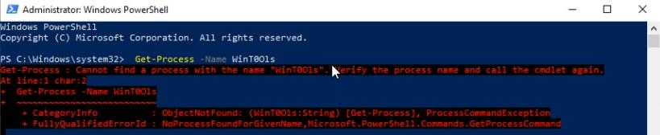

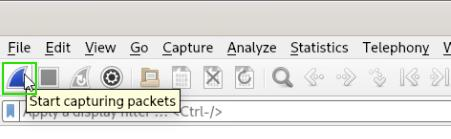
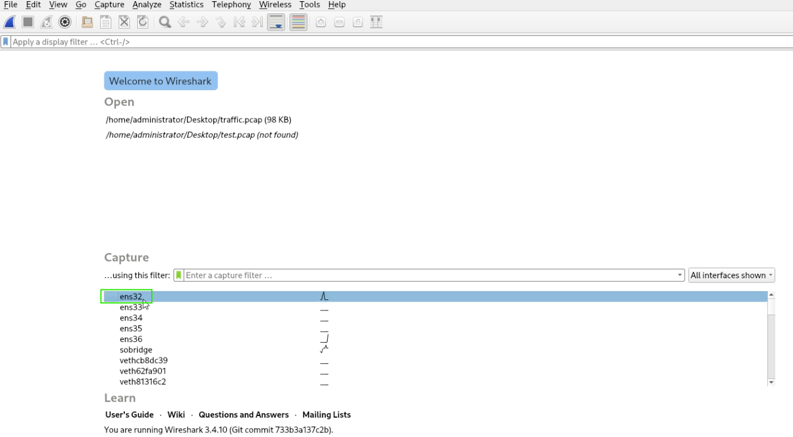

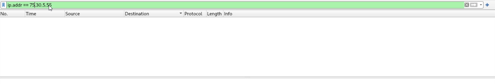
